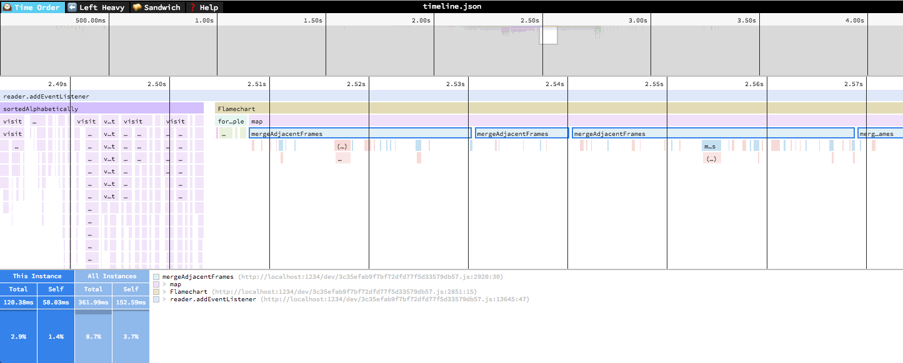
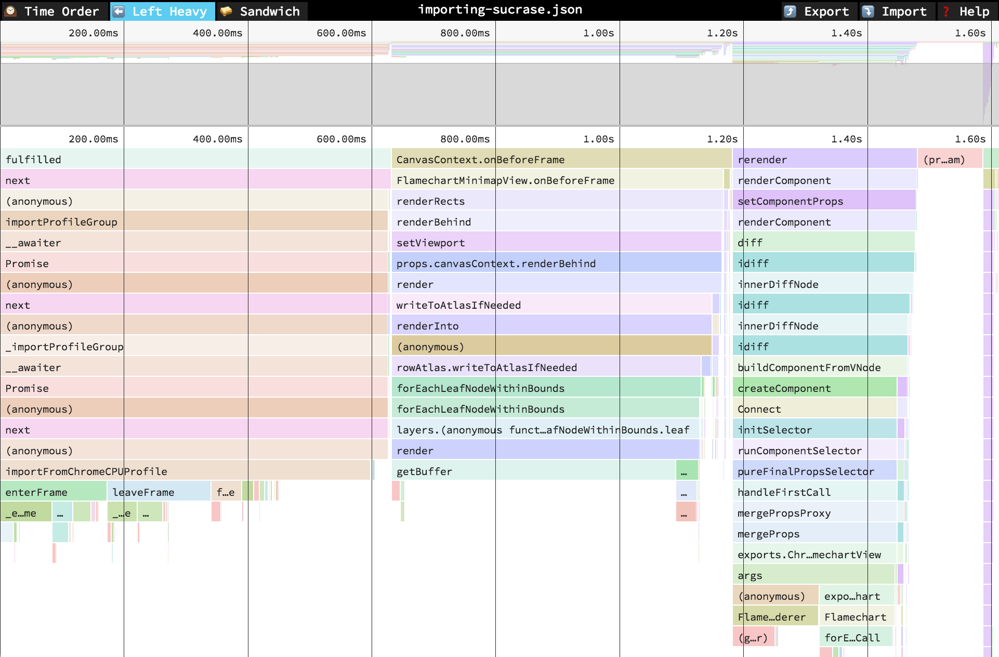
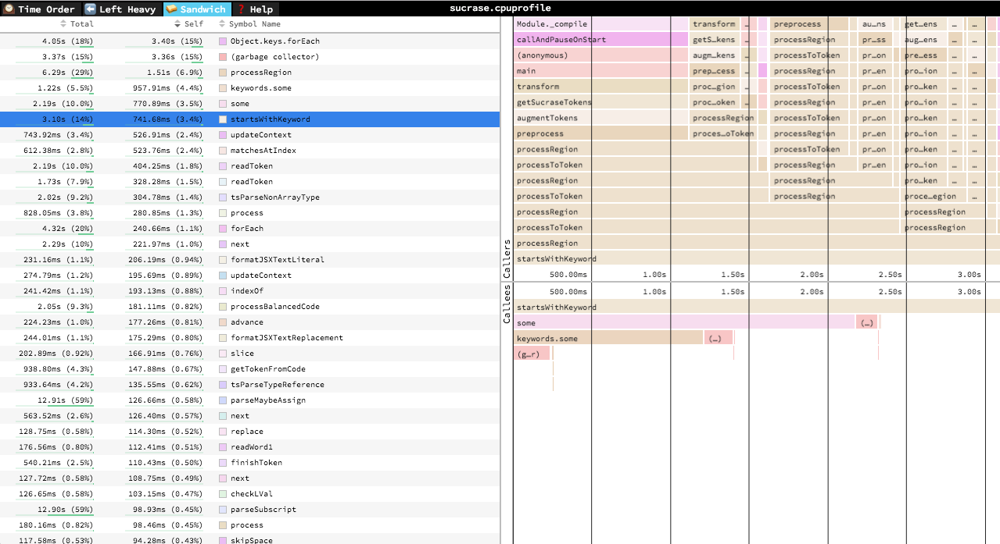

# 🔬speedscope

A fast, interactive web-based viewer for performance profiles. An alternative viewer for _FlameGraphs_. Will happily display multi-megabyte profiles without crashing your browser.

Given raw profiling data, speedscope allows you to interactively explore the data to get insight into what's slow in your application, or allocating all the memory, or whatever data is represented in the profiling data.

# Usage

Visit https://www.speedscope.app, then either browse to find a profile file or drag-and-drop one onto the page. The profiles are not uploaded anywhere -- the application is totally in-browser.

## Command line usage

For offline use, or convenience in the terminal, you can also install speedscope
via npm:

    npm install -g speedscope

Invoking `speedscope /path/to/profile` will load speedscope in your default browser.

## Self-contained directory

If you don't have npm or node installed, you can also download a
self-contained version from teh release page.
After you download the zip file from a release, simply unzip it and open the
contained `index.html` in Chrome or Firefox.

## Views

### 🕰Time Order

In the "Time Order" view (the default), call stacks are ordered left-to-right in the same order as they occurred in the input file, which is usually going to be the chronological order they were recorded in. This view is most helpful for understanding the behavior of an application over time, e.g. "first the data is fetched from the database, then the data is prepared for serialization, then the data is serialized to JSON".

The horizontal axis represents the "weight" of each stack (most commonly CPU time), and the vertical axis shows you the stack active at the time of the sample. If you click on one of the frames, you'll be able to see summary statistics about it.

### ⬅️Left Heavy

In the "Left Heavy" view, identical stacks are grouped together, regardless of whether they were recorded sequentially. Then, the stacks are sorted so that the heaviest stack for each parent is on the left -- hence "left heavy". This view is useful for understanding where all the time is going in situations where there are hundreds or thousands of function calls interleaved between other call stacks.

### 🥪 Sandwich

The Sandwich view is a table view in which you can find a list of all functions an their associated times. You can sort by self time or total time.
It's called "Sandwich" view because if you select one of the rows in the table, you can see flamegraphs for all the callers and callees of the selected
row.

## Navigation

Once a profile has loaded, the main view is split into two: the top area is the "minimap", and the bottom area is the "stack view".

### Minimap Navigation

* Scroll on either axis to pan around
* Click and drag to narrow your view to a specific range

### Stack View Navigation

* Scroll on either axis to pan around
* Pinch to zoom
* Hold Cmd+Scroll to zoom
* Double click on a frame to fit the viewport to it
* Click on a frame to view summary statistics about it

### Keyboard Navigation

* `+`: zoom in
* `-`: zoom out
* `0`: zoom out to see the entire profile
* `w`/`a`/`s`/`d` or arrow keys: pan around the profile
* `1`: Switch to the "Time Order" view
* `2`: Switch to the "Left Heavy" view
* `3`: Switch to the "Sandwich" view
* `r`: Collapse recursion in the flamegraphs
* `Cmd+S`/`Ctrl+S` to save the current profile
* `Cmd+O`/`Ctrl+O` to open a new profile
* `n`: Go to next profile/thread if one is available
* `p`: Go to previous profile/thread if one is available
* `t`: Open the profile/thread selector if available
* `Cmd+F`/`Ctrl+F`: to open search. While open, `Enter` and `Shift+Enter` cycle through results

## Supported file formats

speedscope is designed to ingest profiles from a variety of different profilers for different programming languages & environments. Click the links below for documentation on how to import from a specific source.

- JavaScript
  - [Importing from Chrome](https://github.com/jlfwong/speedscope/wiki/Importing-from-Chrome)
  - [Importing from Firefox](https://github.com/jlfwong/speedscope/wiki/Importing-from-Firefox)
  - [Importing from Safari](https://github.com/jlfwong/speedscope/wiki/Importing-from-Safari)
  - [Importing from Node.js](https://github.com/jlfwong/speedscope/wiki/Importing-from-Node.js)
- Ruby
  - [Importing from stackprof](https://github.com/jlfwong/speedscope/wiki/Importing-from-stackprof-(ruby))
  - [Importing from rbspy](https://github.com/jlfwong/speedscope/wiki/Importing-from-rbspy-(ruby))
  - [Importing from ruby-prof](https://github.com/jlfwong/speedscope/wiki/Importing-from-ruby-prof)
- Python
  - [Importing from py-spy](https://github.com/jlfwong/speedscope/wiki/Importing-from-py-spy-(python))
  - [pyspeedscope](https://github.com/windelbouwman/pyspeedscope)
  - [Importing from Austin](https://github.com/P403n1x87/austin-python#format-conversion)
- Go
  - [Importing from pprof](https://github.com/jlfwong/speedscope/wiki/Importing-from-pprof-(go))  
- Rust
  - [flamescope](https://github.com/coolreader18/flamescope)
- Native code
  - [Importing from Instruments.app](https://github.com/jlfwong/speedscope/wiki/Importing-from-Instruments.app) (macOS)
  - [Importing from `perf`](https://github.com/jlfwong/speedscope/wiki/Importing-from-perf-(linux)) (linux)
- [Importing from .NET Core](https://github.com/jlfwong/speedscope/wiki/Importing-from-.NET-Core)
- [Importing from GHC (Haskell)](https://github.com/jlfwong/speedscope/wiki/Importing-from-Haskell)
- [Importing from custom sources](https://github.com/jlfwong/speedscope/wiki/Importing-from-custom-sources)

## Importing via URL

To load a specific profile by URL, you can append a hash fragment like `#profileURL=[URL-encoded profile URL]&title=[URL-encoded custom title]`. Note that the server hosting the profile must have CORS configured to allow AJAX requests from speedscope.

